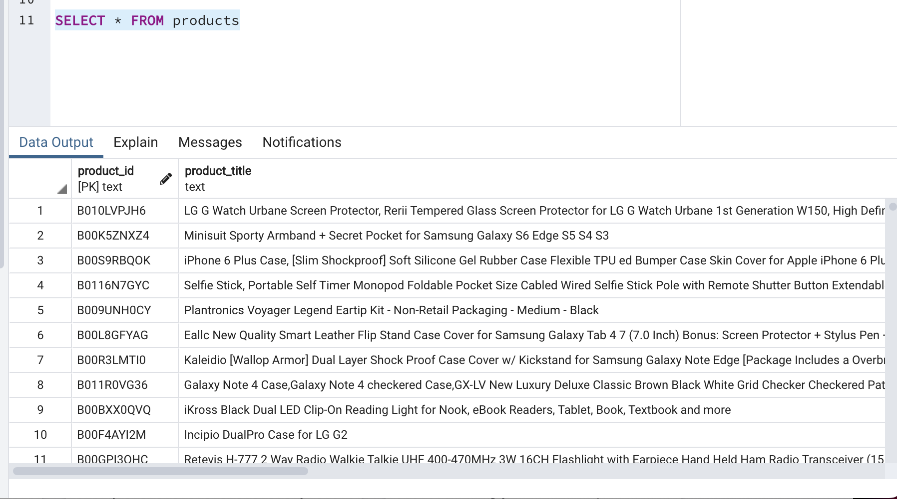

# big-data-challenge

Level 1

Use the furnished schema to create tables in your RDS database.

Create two separate Google Colab notebooks and extract any two datasets from the list at review dataset, one into each notebook.
Note: It is possible to ETL both data sources in a single notebook, but due to the large data sizes, it will be easier to work with these S3 data sources in two separate Colab notebooks.

Be sure to handle the header correctly. If you read the file without the header parameter, you may find that the column headers are included in the table rows.

For each notebook (one dataset per notebook), complete the following:

Count the number of records (rows) in the dataset.

Transform the dataset to fit the tables in the schema file. Be sure the DataFrames match in data type and in column name.

Load the DataFrames that correspond to tables into an RDS instance. Note: This process can take up to 10 minutes for each. Be sure that everything is correct before uploading.

